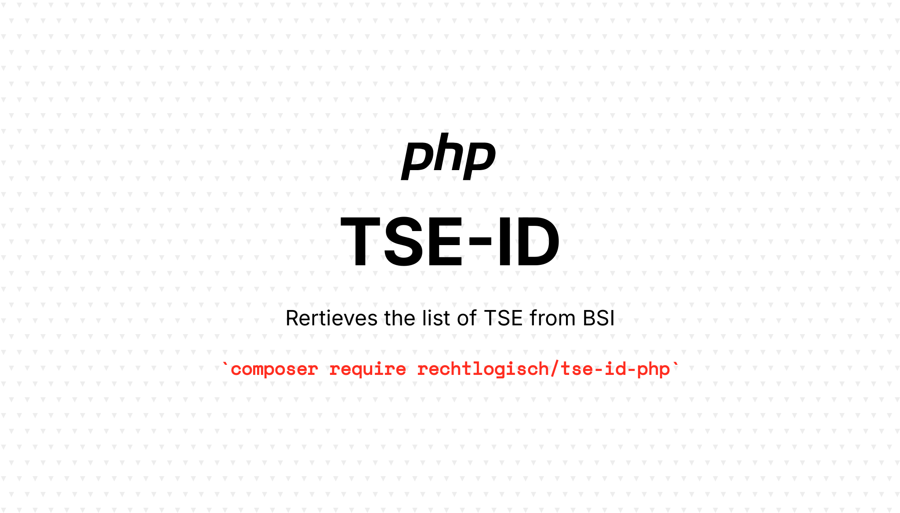

[](https://packagist.org/packages/rechtlogisch/tse-id-php)
[](https://github.com/rechtlogisch/tse-id-php/actions/workflows/run-tests.yml)
[](https://packagist.org/packages/rechtlogisch/tse-id-php)

# tse-id-php

> Retrieves a list of TSE from BSI

## Installation

You can install the package via composer:

```bash
composer require rechtlogisch/tse-id-php
```

## Usage

```php
$retrieve = new Rechtlogisch\TseId\Retrieve;
echo $retrieve->json();
```

## Testing

```bash
composer test
```

## Changelog

Please see [CHANGELOG](CHANGELOG.md) for more information on what has changed recently.

## Contributing

Please see [CONTRIBUTING](https://github.com/rechtlogisch/.github/blob/main/CONTRIBUTING.md) for details.

## Security Vulnerabilities

If you discover any security-related issues, please email open-source@rechtlogisch.de instead of using the issue tracker.

## Credits

- [Krzysztof Tomasz Zembrowski](https://github.com/zembrowski)
- [All Contributors](../../contributors)

## License

The MIT License (MIT). Please see [License File](LICENSE.md) for more information.
